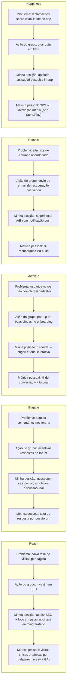

# ultrapendia-dion

```mermaid
graph LR
  subgraph Reach
    R_Problema["Problema: baixa taxa de visitas por página"]
    R_Acao["Ação do grupo: investir em SEO"]
    R_Posicao["Minha posição: apoiar SEO + foco em palavras-chave de maior tráfego"]
    R_Metrica["Métrica pessoal: visitas únicas orgânicas por palavra-chave (via GA)"]
    R_Problema --> R_Acao --> R_Posicao --> R_Metrica
  end

  subgraph Engage
    E_Problema["Problema: poucos comentários nos fóruns"]
    E_Acao["Ação do grupo: incentivar respostas no fórum"]
    E_Posicao["Minha posição: questionei se incentivos motivam discussão real"]
    E_Metrica["Métrica pessoal: taxa de resposta por post/fórum"]
    E_Problema --> E_Acao --> E_Posicao --> E_Metrica
  end

  subgraph Activate
    A_Problema["Problema: usuários novos não completam cadastro"]
    A_Acao["Ação do grupo: pop-up de boas‑vindas no onboarding"]
    A_Posicao["Minha posição: discordei – sugeri tutorial interativo"]
    A_Metrica["Métrica pessoal: % de conversão via tutorial"]
    A_Problema --> A_Acao --> A_Posicao --> A_Metrica
  end

  subgraph Convert
    C_Problema["Problema: alta taxa de carrinho abandonado"]
    C_Acao["Ação do grupo: envio de e‑mail de recuperação pós‑venda"]
    C_Posicao["Minha posição: sugeri teste A/B com notificação push"]
    C_Metrica["Métrica pessoal: % recuperação via push"]
    C_Problema --> C_Acao --> C_Posicao --> C_Metrica
  end

  subgraph Happiness
    H_Problema["Problema: reclamações sobre usabilidade no app"]
    H_Acao["Ação do grupo: criar guia em PDF"]
    H_Posicao["Minha posição: apoiado, mas sugeri pesquisa in‑app"]
    H_Metrica["Métrica pessoal: NPS ou avaliação média (App Store/Play)"]
    H_Problema --> H_Acao --> H_Posicao --> H_Metrica
  end
```
